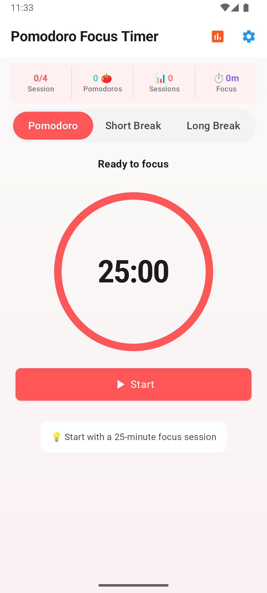
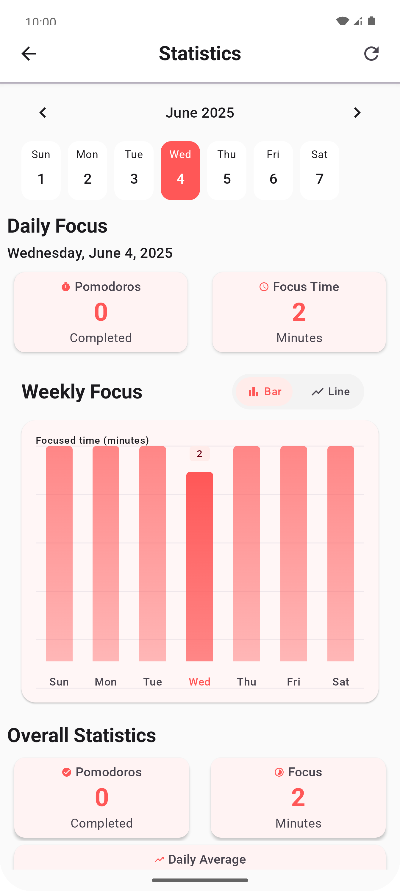
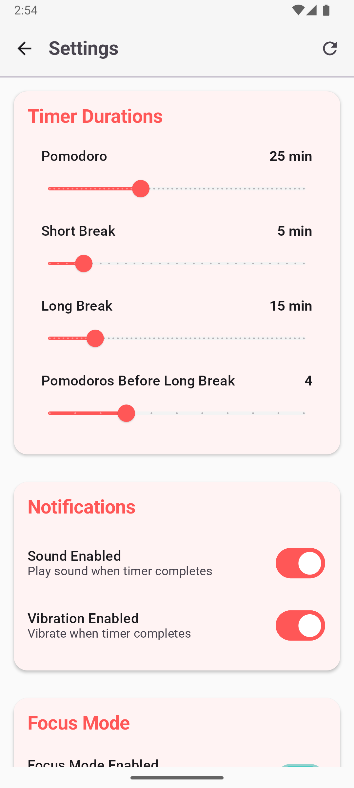

# Pomodoro Focus Timer

A minimalist yet powerful **Pomodoro Technique**-based productivity app built using **Jetpack Compose**, following a clean and scalable architecture with **MVVM** and **MVI** patterns.

---

## ✦ Features

- Customizable Pomodoro, short break, and long break durations
- Circular animated timer
- Daily and weekly focus reports
- Light and dark theme support
- Distraction-free focus mode
- Motivational quotes after sessions
- Fully offline support

---

## ✦ Tech Stack

- **Language:** Kotlin
- **UI:** Jetpack Compose
- **Architecture:** MVVM + MVI
- **State Management:** Kotlin `StateFlow`, `SharedFlow`
- **Dependency Injection:** Koin (or Hilt)
- **Persistence:** DataStore for settings, Room for history
- **Navigation:** Jetpack Navigation Compose
- **Other:** Coroutine-based background timer logic

---


## ✦ Architecture Principles

- **MVVM** for separation of concerns (ViewModel controls state)

- **MVI** for predictable state & unidirectional data flow:

  - `Intent` → User actions
  - `ViewModel` handles `Intent`, emits new `UiState`
  - `UiState` → Drives UI
  - `UiEffect` → One-time events (navigation, toasts)


## ✦ How to Run

```bash
# Clone repository
git clone https://github.com/SultonUzDev/PomodoroFocusTimer.git
cd PomodoroFocusTimer

# Open with Android Studio
# Build and Run the app on emulator or real device
```

---

## ✦ Screenshots

> (Add screenshots here once available)

### ⏱️ Focus Timer


### 📊  Statistics


### ⚙️ Settings


---

## ✦ License

```
MIT License
...
```

---

Made with ❤️ using Kotlin and Jetpack Compose.
