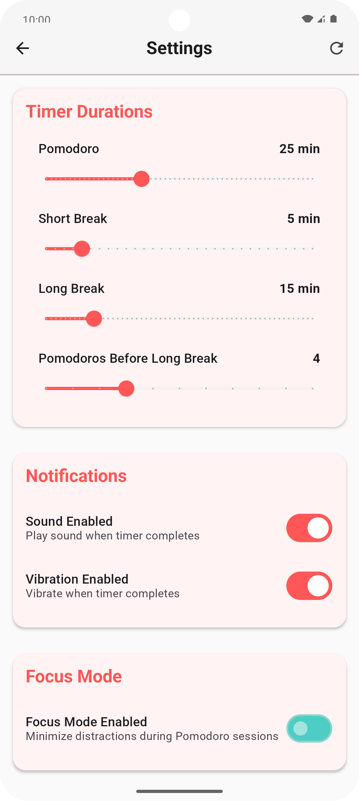
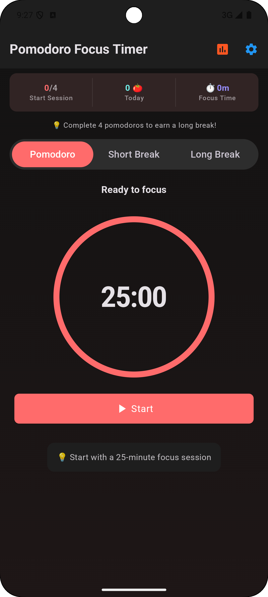

# Pomodoro Focus Timer

A minimalist yet powerful **Pomodoro Technique**-based productivity app built using **Jetpack
Compose**, following a clean and scalable architecture with **MVVM** and **MVI** patterns.

---

<a href="https://play.google.com/store/apps/details?id=com.sultonuzdev.pft">
  
</a>

---

## ✦ Features

- Customizable Pomodoro, short break, and long break durations
- Circular animated timer
- Daily and weekly focus reports
- Light and dark theme support
- Distraction-free focus mode
- Motivational quotes after sessions
- Fully offline support

---

## ✦ Tech Stack

- **Language:** Kotlin
- **UI:** Jetpack Compose
- **Architecture:** MVVM + MVI
- **State Management:** Kotlin `StateFlow`, `SharedFlow`
- **Dependency Injection:** Koin (or Hilt)
- **Persistence:** DataStore for settings, Room for history
- **Navigation:** Jetpack Navigation Compose
- **Other:** Coroutine-based background timer logic

---

## ✦ Architecture Principles

- **MVVM** for separation of concerns (ViewModel controls state)

- **MVI** for predictable state & unidirectional data flow:

    - `Intent` → User actions
    - `ViewModel` handles `Intent`, emits new `UiState`
    - `UiState` → Drives UI
    - `UiEffect` → One-time events (navigation, toasts)

## ✦ How to Run

```bash
# Clone repository
git clone https://github.com/SultonUzDev/PomodoroFocusTimer.git
cd PomodoroFocusTimer

# Open with Android Studio
# Build and Run the app on emulator or real device
```

---

## ✦ Screenshots

<div align="center">
  
  
  
  
</div>


---

## ✦ MIT License

```
Copyright (c) 2025 SultonUzDev

Permission is hereby granted, free of charge, to any person obtaining a copy
of this software and associated documentation files (the "Software"), to deal
in the Software without restriction, including without limitation the rights
to use, copy, modify, merge, publish, distribute, sublicense, and/or sell
copies of the Software, and to permit persons to whom the Software is
furnished to do so, subject to the following conditions:

The above copyright notice and this permission notice shall be included in all
copies or substantial portions of the Software.

THE SOFTWARE IS PROVIDED "AS IS", WITHOUT WARRANTY OF ANY KIND, EXPRESS OR
IMPLIED, INCLUDING BUT NOT LIMITED TO THE WARRANTIES OF MERCHANTABILITY,
FITNESS FOR A PARTICULAR PURPOSE AND NONINFRINGEMENT. IN NO EVENT SHALL THE
AUTHORS OR COPYRIGHT HOLDERS BE LIABLE FOR ANY CLAIM, DAMAGES OR OTHER
LIABILITY, WHETHER IN AN ACTION OF CONTRACT, TORT OR OTHERWISE, ARISING FROM,
OUT OF OR IN CONNECTION WITH THE SOFTWARE OR THE USE OR OTHER DEALINGS IN THE
SOFTWARE.

```
